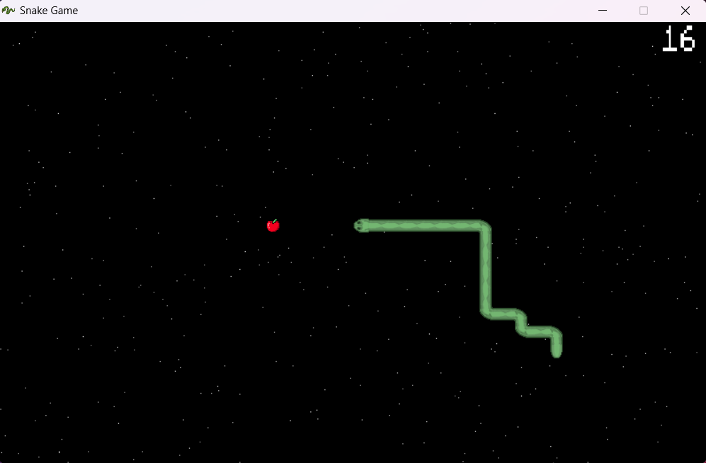

# Snake Game

This is a simple Snake Game implemented in C using SDL2 library. The game allows players to control a snake to eat apples and grow longer without hitting itself.



## Features

- Control the snake using arrow keys (Up, Down, Left, Right)
- Snake grows longer after eating apples
- Score is displayed and updated as the snake eats apples
- Random generation of apples and stars for visual effects
- Menu system with start and exit options

## Prerequisites

Before running the game, ensure you have the following dependencies installed:

- SDL2 library
- SDL2_image extension for image loading
- SDL2_ttf extension for text rendering
- SDL2_mixer extension for audio playback

## Installation

Once SDL2 is set up, clone the repository and navigate to the project directory. Use the following commands:

1. Clone the repository:

   ```shell
   git clone https://github.com/SBAI-Youness/Snake_Game.git
   ```

2. Navigate to the project directory using the following commands:

    ```shell
    make  # Build the code
    cd build
    ./main.exe  # Run the game
    ```
## Credits

This Snake Game was initially created by **Youness SBAI**. See the [Credits](#credits) section in the project for more information.

## License

Snake Game is released under the MIT License. See the [LICENSE](LICENSE) file for more details.

---